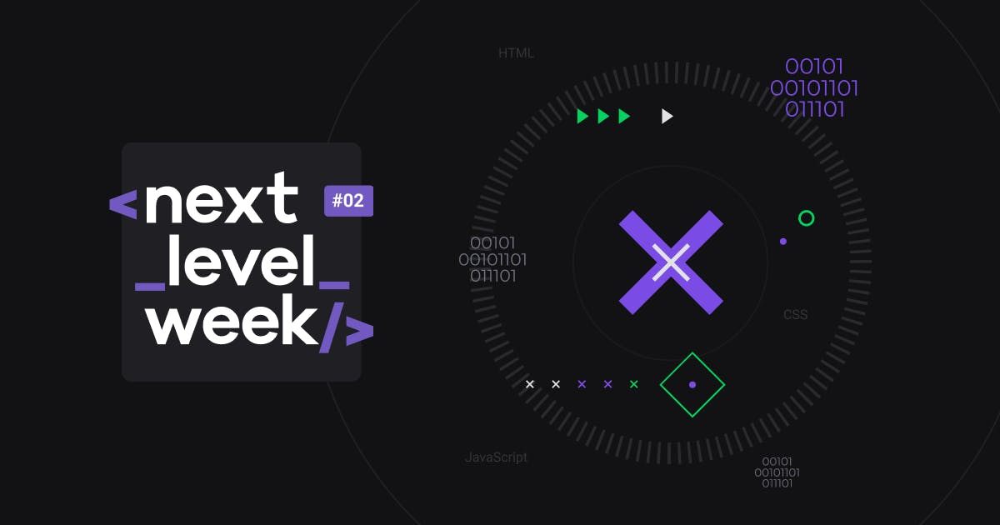

</img>
<h1 align="center">Next Level Week II</h1>
<p align="center">Project <strong>Proffy</strong> developed during the Rocketseat Next Level Week II</p>

<p align="center">
  <a aria-label="NodeJs version" href="https://github.com/nodejs/node/blob/master/doc/changelogs/CHANGELOG_V12.md#12.14.1">
    </img>
  </a>
  <a aria-label="ReactJs version" href="https://github.com/facebook/react/blob/master/CHANGELOG.md#16120-november-14-2019">
    </img>
  </a>
</p>
<h1 align="center">
  </img>
  <p align="center"> <strong>Work in progress...</strong> </p>
</h1>

## Instalation
To install the dependencies and to execute the **Frontend**, clone the project on your computer an execute:
```bash
cd web
yarn install
yarn start
```

## Frontend

</img>

To run the React's **Frontend** use:
```bash
cd web
yarn start
```
When the process end, automatically will open the page `localhost:3000` on your web browser with de Project Proffy.

## Licence

[MIT](./LICENSE) &copy; [Rocketseat](https://rocketseat.com.br/)

Made with ♥ by Diego Andrade :wave: [Get in touch!](https://www.linkedin.com/in/diego-rodrigo-de-andrade-98a0271a0/)
